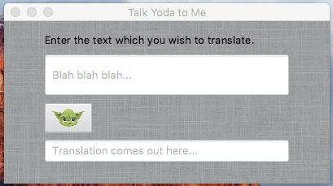

# What does this application do?

Answers the question: (if you've ever wondered)  
What would my sentence look like if Yoda/Minion/a pirate/a Valley Girl/a Baby (if only) had written it?  

# How does it work? or How do I try it out? 

Download the YodaTranslator.jar file.  
Open your terminal or command line and enter the directory which the jar file is located.  

A. Enter the command " java -jar YodaTranslator.jar ".  
B. The program should start and you should see the program up and running.

C. Enter a sentence into the first textfield, then click on Yoda.

D. Translation will be displayed on the bottom. 

Note: YodaTranslator.jar only supports translation of sentences into Yoda style. Intended for preview of how full application works. For full usage see <i>Loading Application Instructions</i> below. 

Screenshot of full application:

# Executing Full Application Instructions

<b>API Key Retrieval Instructions</b>

Login  or Register for an account at <a href="http://market.mashape.com">Market Mashape</a>

Once you've found the corresponding APIs (Yoda Speak, Minion Translator, Pirate Translator, Valley Girl Translator,and LOLCat Transator) and subscribed, please go to the Documentation Tab for each translator. In the request example section, look for the Mashape Key. Copy the key.

Go to SpeakingStyle.java and paste your key in all locations that are stated "INSERT-KEY-HERE". <b>Note: Keep the quotations! </b>

For access to Minion, Pirate, Valley Girl and LOLCat Translations, please note the pricing options.  
Example:  

Note: You will be asked to enter your credit card information to activate subscription. Please be sure to note the number of translations you may do for each format before you will be charged. Yoda's translation does not have a limit on API 
 

# Application Image credits

Yoda - http://vector-magz.com/wp-content/uploads/2013/07/yoda-vector1.jpg
 
Minion -http://mooshworld.com/wp-content/uploads/2014/11/1-620x699.jpg
 
Pirate -https://openclipart.org/image/2400px/svg_to_png/220801/Pirate-Flag.png
 
Valley Girl - Input at http://cooltext.com/Logo-Design-Chick-Flick
 

# Potential Future Features of Application 

<li> Implement Text to Speech API </li>
<li> Support for Android devices. </li>
